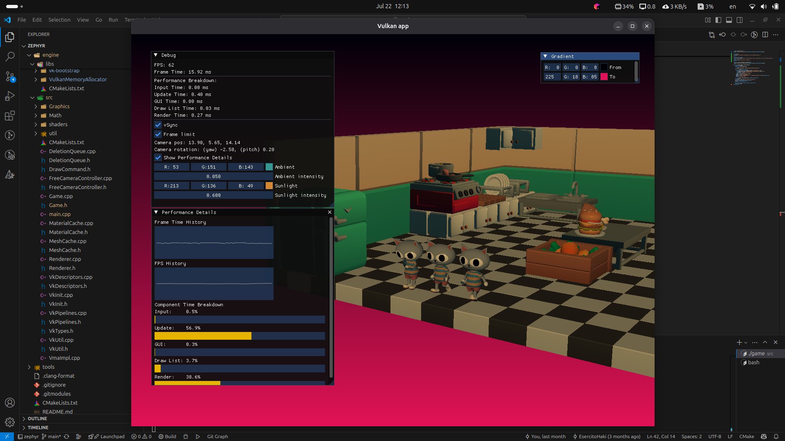

# Đây là project Game Engine Vulkan

## Hướng Dẫn Cài Đặt & Chạy Dự Án

### 1. Clone project về máy
```bash
git clone https://github.com/EsercitoHaki/zephyr.git
cd zephyr
```

### 2. Cài đặt Cmake
Trên Window
```bash
winget install Kitware.CMake
```
Trên Linux (Distro Arach)
```bash
sudo pacman -Syu
sudo pacman -S cmake
```
Trên macOS
```bash
brew install cmake
```

### 3. Cài đặt Vulkan SDK
```bash
./tools/install-vulkan-sdk.sh
```

### 4. Build
```bash
mkdir build
cd build
cmake ..
make
```

### 5. Run
```bash
./engine/src/game
```

### 6. Screenshots
